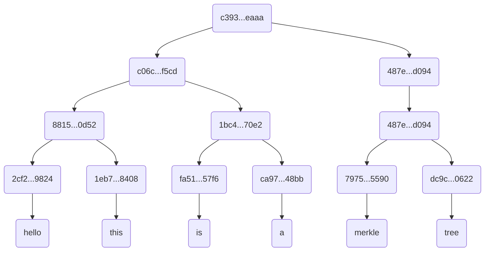

# Go-Test

A simple implementation of Merkle Tree in Go.  
Takes an array of strings as input and returns the Merkle root of the tree.


### How to run
 1. Clone the repo
 2. go run test.go

### Test run result
Providing the input of the following array with sha256 encryption :  
```["hello", "this", "is", "a", "merkle", "tree"]```  
The resulting merkle looks a bit like this   


