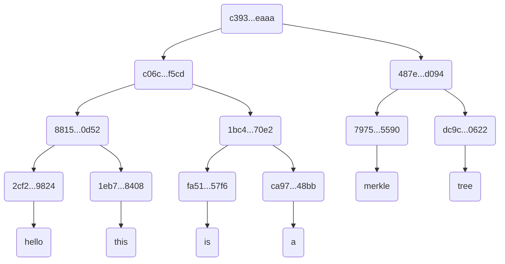

# Go-MerkleTree

A simple implementation of [Merkle Tree](https://en.wikipedia.org/wiki/Merkle_tree) in Go.

Takes an array of strings as input and returns the Merkle root of the tree.

## How to run

* Clone the repo

    ```bash
    git clone git@github.com:dafaqdhruv/Go-MerkleTree.git && cd Go-MerkleTree
    ```

* Build executable

    ```bash
    go build
    ```

* Run with input

    ```bash
    ./merkleTree hello this is a merkle tree
    ```

    Expected output

    ```text
    Root hash for the input string is
    c393dac244e2441a310dc3a8ca09b2859e3155e572f5f8074db7f35ec6a5eaaa
    ```

## Test merkle package

* Inside repository root, switch to `merkle` directory

    ```bash
    cd merkle
    ```

* Run test to check if package works correctly

    ```bash
    go test
    ```

The test builds a Merkle tree using the following array as input:

```text
["hello", "this", "is", "a", "merkle", "tree"]
```

The resulting Merkle tree is shown below:


